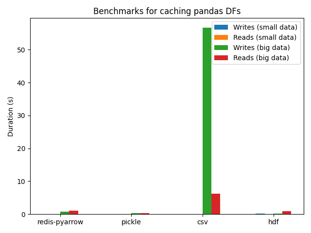

# Pandas Cache Benchmark (08-2021)

This small script compares several method to save & load pandas dataframes in terms of time.

My usecase was to save stock data with some properties to use it later, so for the big data I generated a large DF with floating numbers.

Methods compared:

- Redis (serializing / deserializing via pyarrow)
- Pickle
- CSV
- HDF5
- (Had json here too but it failed to serialize my big DF)

## Results:

```text
--- preparing data
------ generating very small DF
------ generating big DF with floating numbers as values
--- benchmarking redis-pyarrow
------ Small data - Write with redis-pyarrow: 0.011252880096435547
------ Small data - Read with redis-pyarrow: 0.0033261775970458984
------ Big data - Write with redis-pyarrow: 0.7082719802856445
------ Big data - Read with redis-pyarrow: 1.0988080501556396
--- benchmarking pickle
------ Small data - Write with pickle: 0.0009887218475341797
------ Small data - Read with pickle: 0.0005431175231933594
------ Big data - Write with pickle: 0.40320301055908203
------ Big data - Read with pickle: 0.3689420223236084
--- benchmarking csv
------ Small data - Write with csv: 0.060813188552856445
------ Small data - Read with csv: 0.013083934783935547
------ Big data - Write with csv: 56.73444390296936
------ Big data - Read with csv: 6.29616117477417
--- benchmarking hdf
------ Small data - Write with hdf: 0.17034006118774414
------ Small data - Read with hdf: 0.006501913070678711
------ Big data - Write with hdf: 0.16461515426635742
------ Big data - Read with hdf: 0.990962028503418
```

### In a barchart:



### And without csv so it's easier to compare:

")

# tl;dr

In my usecase of caching large stock data in pandas dataframes, pickle seems to be the winner! Feel free to let me know if you have better suggestions.
